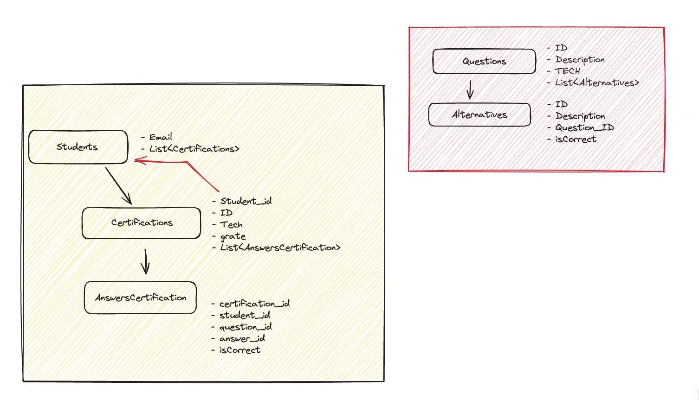

<a name="certification_nlw"></a>

[![Contributors][contributors-shield]][contributors-url]
[![Forks][forks-shield]][forks-url]
[![Stargazers][stars-shield]][stars-url]
[![Issues][issues-shield]][issues-url]
[![LinkedIn][linkedin-shield]][linkedin-url]


<!-- PROJECT LOGO -->
<br />
<div align="center">

  <h3 align="center">Certification NLW</h3>

  <p align="center">
    Web application built in Java and Spring Boot during nlw expert by rocketseat
    <br />
    <a href="https://github.com/luk3mn/certification_nlw/README.md"><strong>Explore the docs »</strong></a>
    <br />
    <br />
  </p>
</div>


<!-- TABLE OF CONTENTS -->
<details>
  <summary>Table of Contents</summary>
  <ol>
    <li>
      <a href="#about-the-project">About The Project</a>
      <ul>
        <li><a href="#built-with">Built With</a></li>
      </ul>
    </li>
    <li>
      <a href="#getting-started">Getting Started</a>
      <ul>
        <li><a href="#prerequisites">Prerequisites</a></li>
        <li><a href="#installation">Installation</a></li>
      </ul>
    </li>
    <li><a href="#usage">Usage</a></li>
    <li><a href="#roadmap">Roadmap</a></li>
    <li><a href="#license">License</a></li>
    <li><a href="#contact">Contact</a></li>
    <li><a href="#acknowledgments">Acknowledgments</a></li>
  </ol>
</details>


<!-- ABOUT THE PROJECT -->
## About The Project



<p align="justify">
  In this project, we were able to find subjects like, such as: 

  - **ORM;** 
  - **JPA;** 
  - **Rest API;**
</p> 

<p align="right">(<a href="#certification_nlw">back to top</a>)</p>


### Built With

Write here

* [![Java][Java]][Java-url]
* [![Spring][Spring]][Spring-url]
* [![PostgreSQL][PostgreSQL]][PostgreSQL-url]

<p align="right">(<a href="#certification_nlw">back to top</a>)</p>


<!-- GETTING STARTED -->
## Getting Started

Here are some important topics about this project and how to replay it.

### Prerequisites

  Clone the repo
   ```sh
   git clone https://github.com/luk3mn/todolist.git
   ```

<!-- ### Installation

_Before starting this application in your local environment, it'll be necessary to proceed with some tasks to reproduce this project._

2. Install packages
   ```sh
   
   ``` -->

<p align="right">(<a href="#certification_nlw">back to top</a>)</p>


<!-- USAGE EXAMPLES -->
## Usage

> CREATE SQL
  ```SQL
    INSERT INTO questions (id, description, technology) VALUES
    ('c5f02721-6dc3-4fa6-b46d-6f2e8dca9c66', 'Como criar uma classe em Java?', 'JAVA'),
    ('b0ec9e6b-721c-43c7-9432-4d0b6eb15b01', 'Explique o conceito de polimorfismo em Java.', 'JAVA'),
    ('f85e9434-1711-4e02-9f9e-7831aa5c743a', 'Como lidar com exceções em Java?', 'JAVA');
  ```

  ```SQL
    INSERT INTO alternatives (id, question_id, is_correct, description) VALUES
    ('bafdf631-6edf-482a-bda9-7dce1efb1890', 'c5f02721-6dc3-4fa6-b46d-6f2e8dca9c66', true, 'Usando a palavra-chave "class"'),
    ('98f6891b-5f14-4b8e-bb87-46456a2610d4', 'c5f02721-6dc3-4fa6-b46d-6f2e8dca9c66', false, 'Definindo uma interface em Java'),
    ('993a7d37-62a0-4040-810d-d667e3f7a891', 'c5f02721-6dc3-4fa6-b46d-6f2e8dca9c66', false, 'Utilizando métodos estáticos'),
    ('98bf8d0f-dc1c-4db0-b09c-94246089aa02', 'c5f02721-6dc3-4fa6-b46d-6f2e8dca9c66', false, 'Criando um construtor padrão'); 
  ```

  ```SQL
    INSERT INTO alternatives (id, question_id, is_correct, description) VALUES
    ('1da0f5dd-7a02-4c34-8c60-4648b55141f2', 'b0ec9e6b-721c-43c7-9432-4d0b6eb15b01', false, 'Herança simples'),
    ('c4fd1c23-8993-4972-92d5-b8364b78d1cf', 'b0ec9e6b-721c-43c7-9432-4d0b6eb15b01', false, 'Encapsulamento em Java'),
    ('9da03a4e-3c8d-4a32-87e1-9898938435c2', 'b0ec9e6b-721c-43c7-9432-4d0b6eb15b01', false, 'Sobrecarga de métodos'),
    ('f8e6e9b3-199b-4f0d-97ce-7e5bdc080da9', 'b0ec9e6b-721c-43c7-9432-4d0b6eb15b01', true, 'Capacidade de um objeto de assumir várias formas');
  ```

  ```SQL
    INSERT INTO alternatives (id, question_id, is_correct, description) VALUES
    ('3528a132-9c12-4c8a-aa93-9f6e813c43d1', 'f85e9434-1711-4e02-9f9e-7831aa5c743a', false, 'Ignorando a exceção'),
    ('d3e51a56-9b97-4bb8-9827-8bcf89f4b276', 'f85e9434-1711-4e02-9f9e-7831aa5c743a', true, 'Utilizando blocos try-catch'),
    ('63c0210c-2a9a-4e93-98ec-8d9f3984e2b0', 'f85e9434-1711-4e02-9f9e-7831aa5c743a', false, 'Declarando uma exceção sem tratamento'),
    ('e4dbf524-0a54-428a-b57c-853996fc8e19', 'f85e9434-1711-4e02-9f9e-7831aa5c743a', false, 'Usando a palavra-chave "finally"');
  ```

<!-- ROADMAP -->
## Roadmap

- [x] Back-end configuration
- [x] Students: entities, repository, dto, useCases, controllers
- [x] ORM: Database implementation
- [x] Questions: Entities and Repository
- [x] Exception treatment
- [x] Top 10 ranking
- [ ] Back-end deploy


<p align="right">(<a href="#certification_nlw">back to top</a>)</p>


<!-- LICENSE -->
<!-- ## License

Distributed under the MIT License. See `LICENSE.txt` for more information.

<p align="right">(<a href="#certification_nlw">back to top</a>)</p> -->


<!-- CONTACT -->
## Contact

Lucas Renan - lucasnunes2030@gmail.com

Project Link: [https://github.com/luk3mn/certification_nlw](https://github.com/luk3mn/certification_nlw)

<p align="right">(<a href="#certification_nlw">back to top</a>)</p>


<!-- ACKNOWLEDGMENTS -->
## Acknowledgments

* [Rocketseat](https://www.rocketseat.com.br/)


<p align="right">(<a href="#certification_nlw">back to top</a>)</p>


<!-- MARKDOWN LINKS & IMAGES -->
<!-- https://www.markdownguide.org/basic-syntax/#reference-style-links -->
[contributors-shield]: https://img.shields.io/github/contributors/luk3mn/certification_nlw.svg?style=for-the-badge
[contributors-url]: https://github.com/luk3mn/certification_nlw/graphs/contributors
[issues-shield]: https://img.shields.io/github/issues/luk3mn/certification_nlw.svg?style=for-the-badge
[issues-url]: https://github.com/luk3mn/certification_nlw/issues
[forks-shield]: https://img.shields.io/github/forks/luk3mn/certification_nlw.svg?style=for-the-badge
[forks-url]: https://github.com/luk3mn/certification_nlw/network/members
[stars-shield]: https://img.shields.io/github/stars/luk3mn/certification_nlw.svg?style=for-the-badge
[stars-url]: https://github.com/luk3mn/certification_nlw/stargazers
[license-shield]: https://img.shields.io/github/license/othneildrew/Best-README-Template.svg?style=for-the-badge
[license-url]: https://github.com/luk3mn/certification_nlw/blob/master/LICENSE
[linkedin-shield]: https://img.shields.io/badge/-LinkedIn-black.svg?style=for-the-badge&logo=linkedin&colorB=555
[linkedin-url]: https://www.linkedin.com/in/lucasmaues/
[general-code-screenshot]: assets/general-project.png

<!-- Stack Shields -->
<!-- Stack Shields -->
[Java]: https://img.shields.io/badge/Java-E02027?style=for-the-badge&logo=java&logoColor=ffffff
[Java-url]: https://www.java.com/en/
[Spring]: https://img.shields.io/badge/SrpingBoot-6DB33F?style=for-the-badge&logo=springboot&logoColor=ffffff
[Spring-url]: https://spring.io/projects/spring-boot
[PostgreSQL]: https://img.shields.io/badge/POSTGRESQL-4169E1?style=for-the-badge&logo=postgresql&logoColor=ffffff
[PostgreSQL-url]: https://www.postgresql.org/